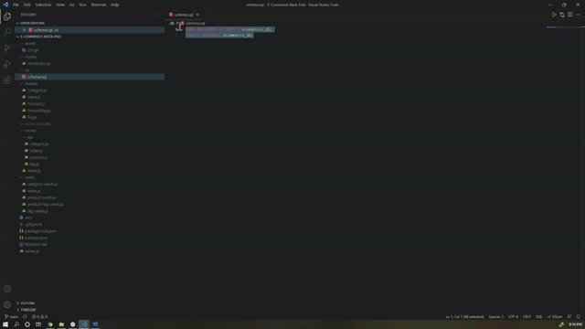

# E-Commerce-Back-End

## What is this project about?

Internet retail, also known as e-commerce, is the largest sector of the electronics industry, generating an estimated $29 trillion in 2019. E-commerce platforms like Shopify and WooCommerce provide a suite of services to businesses of all sizes. Due to their prevalence, understanding the fundamental architecture of these platforms will benefit you as a full-stack web developer.

My task was to build the back end for an e-commerce site by modifying starter code. I needed to configure a working Express.js API to use Sequelize to interact with a MySQL database.

## How did I do it?

I used the starter code provided to us and built off of it one piece at a time.  I created the database first and set up the environment so that the server would run properly.

## Installation

* Node.js
* Express.js
* MySQL
* dotENV
* Sequelize

## Usage

I utilized the following applications to showcase the backend work:
 * MySQL Workbench
 * Insomnia
 * VSCode

## Contributors

* Kelsea Hunt

(technically the Bootcamp as well since we had some starter code)

## GIF of Creating Database and full Video of Application

This video shows how to seed the database, start the server, then utilize the GET, POST, PUT, and DELETE methods in Insomnia.

https://drive.google.com/file/d/1DVM749LuW_98wWgwBUb7jZux-FOGhp4F/view

## GIF for Your Eyeball Pleasure

